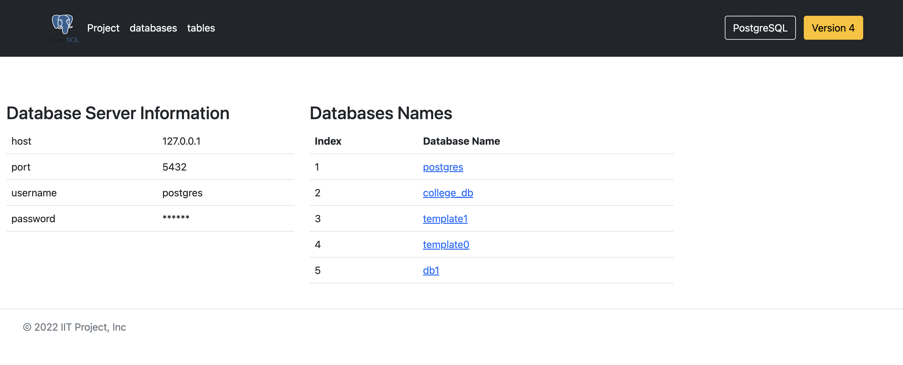
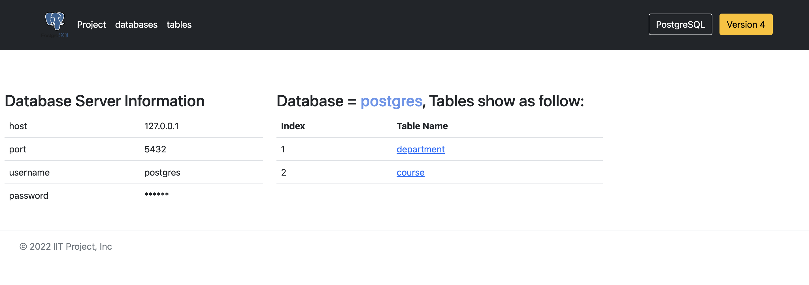
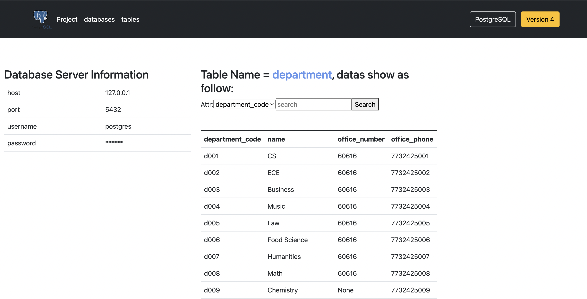
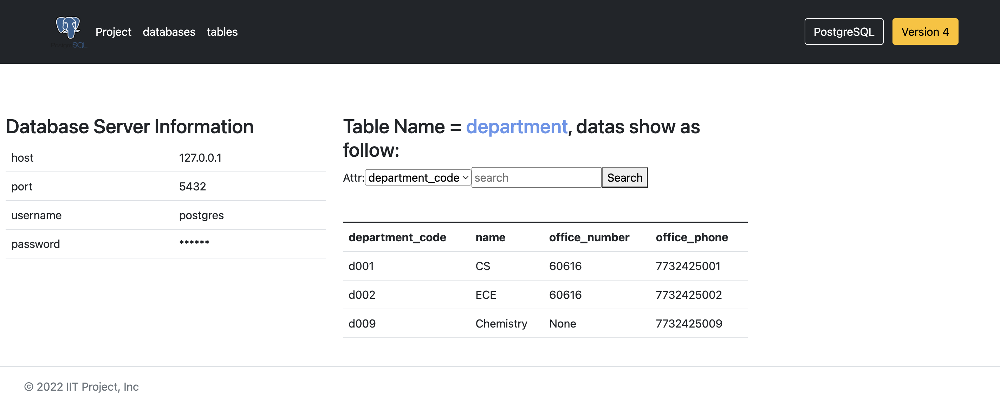
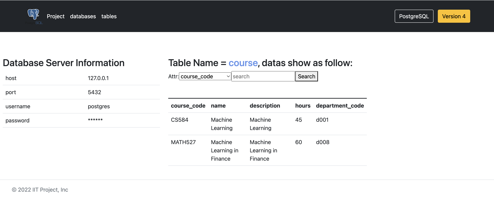

# Project: Connect Database

This is a repo for managing PostgreSQL project. It provides lots of features:

- Connect PostgrepSQL Database
- show all databases in PostgrepSQL Database
- show all table names in PostgrepSQL Database
- show all table datas in PostgrepSQL Database
- filter datas in PostgrepSQL Database

# Projectile in Action

- show all databases in PostgrepSQL Database
  

- show all table names in PostgrepSQL Database
  

- show all table datas in PostgrepSQL Database
  
- filter datas in PostgrepSQL Database
  
- show all table datas in PostgrepSQL Database
  

# Quickstart

The instructions that follow are meant to get you from zero to a running Project setup in a minute.

First, install requirements.txt

```
pip install -r requirements.txt
```

Secondly, Open your PostgreSQL, make sure it runs in your computer and port is 5432.

Last but not least, run the django project

```bash
python manage.py runserver 9900
```

Open your browser and visit the url `http://127.0.0.1:9900`

